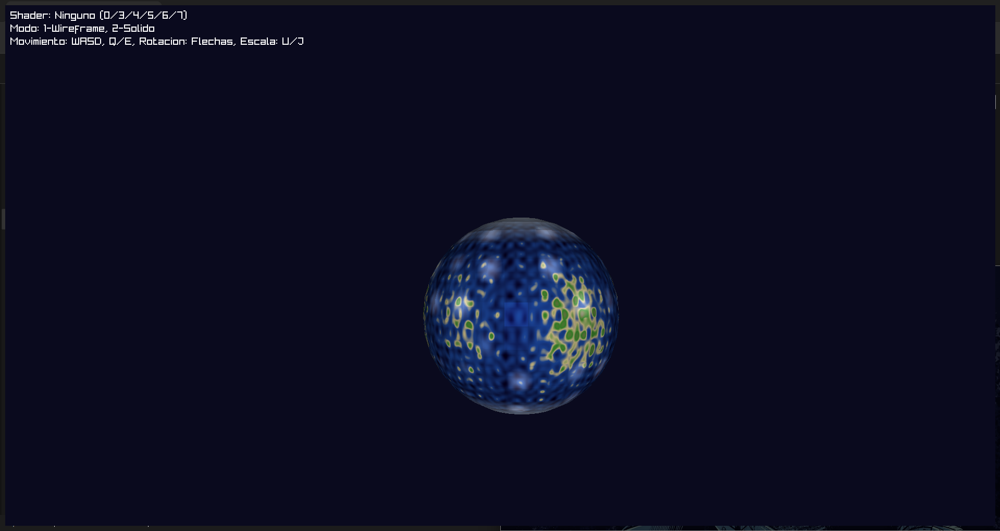
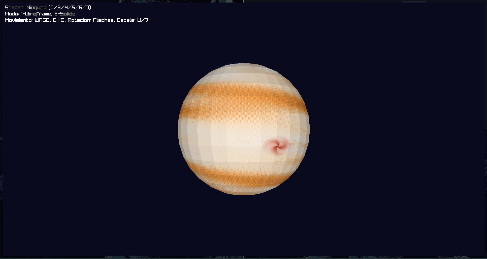
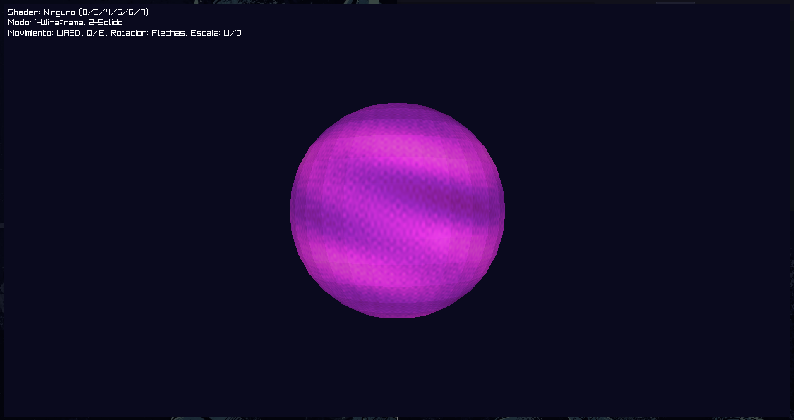
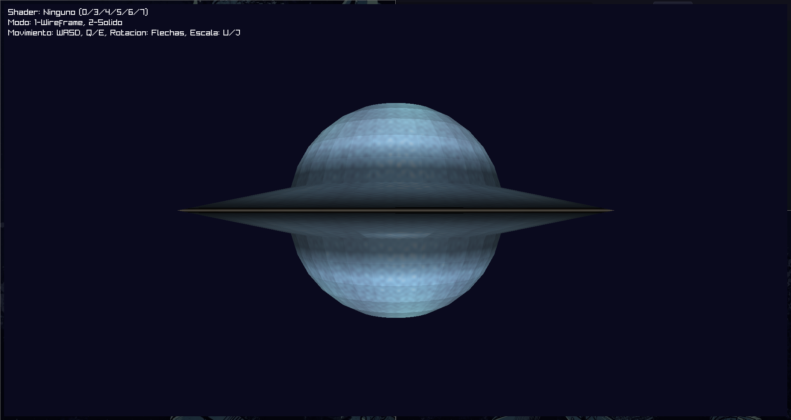
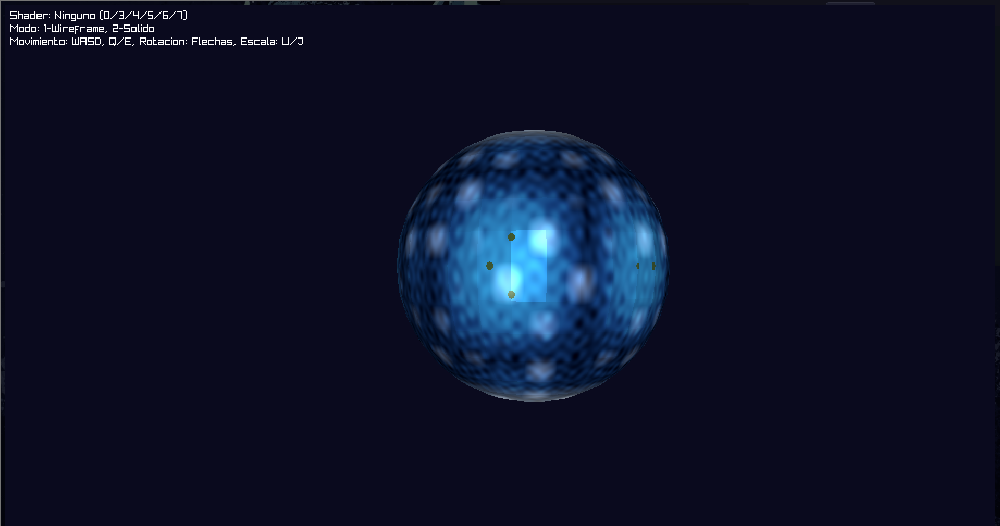

# Sistema de Shaders - Visión General

## Overview

Tierra:


Jupiter:


Magenta:


Anillo:


Mundo de Agua:



## Requisitos Mínimos

### Software Requerido
- **Rust**: versión 1.70 o superior
- **Cargo**: Gestor de paquetes de Rust (incluido con Rust)
- **Sistema Operativo**: Windows, macOS o Linux

### Dependencias del Proyecto
Las siguientes dependencias se instalan automáticamente vía Cargo:
- `raylib` (y `raylib-sys`): Biblioteca gráfica base
- `tobj`: Carga de archivos .obj

## Cómo Ejecutar el Proyecto

### 1. Instalación de Rust
Si aún no tienes Rust instalado:

**En Linux/macOS:**
```bash
curl --proto '=https' --tlsv1.2 -sSf https://sh.rustup.rs | sh
```

**En Windows:**
Descarga e instala desde [rustup.rs](https://rustup.rs/)

### 2. Clonar o Descargar el Proyecto
```bash
git clone <url-del-repositorio>
cd <nombre-del-proyecto>
```

### 3. Verificar Estructura de Archivos
Asegúrate de que la carpeta `models/` contenga el archivo `sphere.obj`:
```
proyecto/
├── src/
│   ├── main.rs
│   ├── shader.rs
│   ├── render.rs
│   └── ...
├── models/
│   └── sphere.obj
└── Cargo.toml
```

### 4. Compilar y Ejecutar
**Modo desarrollo (esta optimizado):**
```bash
cargo run
```

## Parámetros Uniformes

El sistema de shaders utiliza una estructura `Uniforms` para pasar datos dinámicos tanto a los vertex shaders como a los fragment shaders:

```rust
pub struct Uniforms {
    time: f32,              // Tiempo transcurrido para animaciones
    light_direction: Vector3, // Vector de dirección de luz normalizado
    camera_position: Vector3, // Posición de la cámara en espacio mundial
}
```

- **`time`**: Controla todas las animaciones basadas en tiempo (movimiento de nubes, efectos atmosféricos, movimiento orbital)
- **`light_direction`**: Determina la dirección de iluminación para todos los cálculos de sombreado
- **`camera_position`**: Utilizado para efectos dependientes de la vista como brillos especulares

## Pipeline de Shaders

### Vertex Shader
Transforma vértices desde el espacio del objeto a través del pipeline de renderizado. Puede modificar posiciones y normales de vértices antes de la rasterización.

**Firma de Función:**
```rust
fn vertex_shader(&self, vertex: &Vertex, uniforms: &Uniforms) -> Vertex
```

**Entrada:** Vértice original con posición, normal y coordenadas de textura  
**Salida:** Vértice transformado  
**Casos de Uso:** Deformación geométrica, posicionamiento orbital, generación de anillos

### Fragment Shader
Determina el color final de cada píxel basándose en datos de fragmento interpolados.

**Firma de Función:**
```rust
fn fragment_shader(&self, fragment: &Fragment, uniforms: &Uniforms) -> Option<Color>
```

**Entrada:** Fragmento con posición en pantalla, posición mundial, posición de objeto, normal y profundidad  
**Salida:** `Some(Color)` para sombreado personalizado, `None` para iluminación por defecto  
**Casos de Uso:** Texturas procedurales, efectos atmosféricos, cálculos de iluminación

## Shaders Disponibles

| Shader | Tecla | Vertex Shader | Características del Fragment Shader |
|--------|-------|---------------|-------------------------------------|
| **None** | 0 | Por defecto | Iluminación difusa simple |
| **Rocky** | 3 | Por defecto | Características continentales, océanos, nubes, hielo polar, agua especular |
| **Gas Giant** | 4 | Por defecto | Bandas horizontales, sistemas de tormentas, turbulencia, aurora polar |
| **Ringed** | 5 | **Geometría de anillos** | Superficie de planeta helado, renderizado procedural de anillos con transparencia |
| **Magenta** | 6 | **Luna orbital** | Atmósfera púrpura profunda, tormentas brillantes, auto-iluminación |
| **Water World** | 7 | Por defecto | Variación de profundidad oceánica, cadenas de islas, nubes dinámicas, casquetes polares, especular fuerte |

## Técnicas de Shaders

### Ruido Procedural
Todos los shaders utilizan funciones seno/coseno en capas y una función auxiliar `smooth_noise()` para patrones orgánicos:
```rust
fn smooth_noise(x: f32, y: f32, z: f32) -> f32
```

### Texturizado Multi-Capa
Los shaders combinan 4-6 capas procedurales a diferentes frecuencias:
- **Baja frecuencia**: Características a gran escala (continentes, bandas)
- **Frecuencia media**: Detalles (terreno, corrientes de chorro)
- **Alta frecuencia**: Detalle fino (textura superficial, turbulencia)

### Espacio de Objeto vs Espacio Mundial
- **Espacio de objeto** (`fragment.object_position()`): Usado para patrones procedurales que rotan con el planeta
- **Espacio mundial** (`fragment.world_position()`): Usado para efectos dependientes de la vista (brillos especulares) y características de posición fija

### Modelo de Iluminación
Modelo estándar tipo Phong con componentes ajustables:
```rust
intensidad_final = ambiente + difuso * intensidad_luz + especular
```
- **Ambiente**: Iluminación base (0.15-0.4 dependiendo del shader)
- **Difuso**: Sombreado Lambertiano usando `dot(normal, direccion_luz)`
- **Especular**: Brillos dependientes de la vista usando vector de reflexión

### Técnicas Avanzadas
- **Interpolación baricéntrica**: Interpola valores suavemente a través de las caras de los triángulos
- **Prueba de profundidad**: Z-buffer previene sobredibujo
- **Mezcla alfa**: Usado para anillos semi-transparentes
- **Desplazamiento de vértices**: Crea características geométricas (anillos, lunas) reposicionando vértices

## Controles

- **Traslación**: W/A/S/D (horizontal), Q/E (vertical)
- **Rotación**: Flechas del teclado
- **Escala**: U (aumentar), J (disminuir)
- **Modo de Renderizado**: 1 (wireframe), 2 (sólido)
- **Selección de Shader**: 0/3/4/5/6/7
