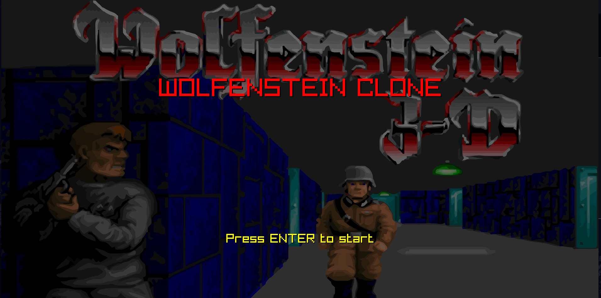
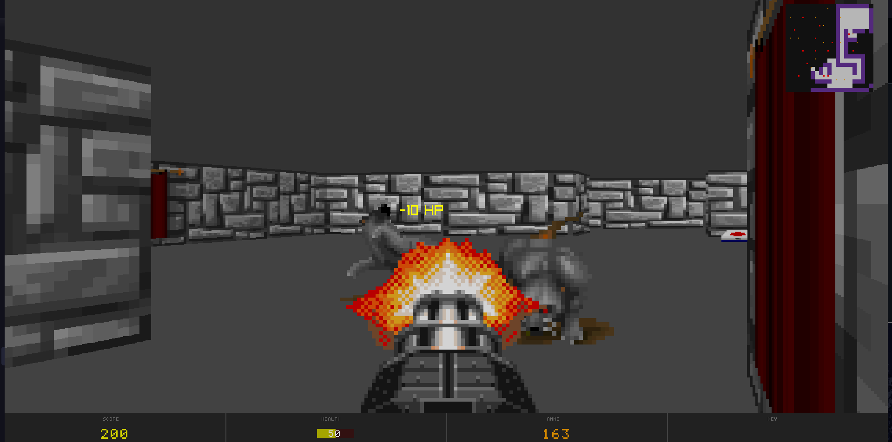
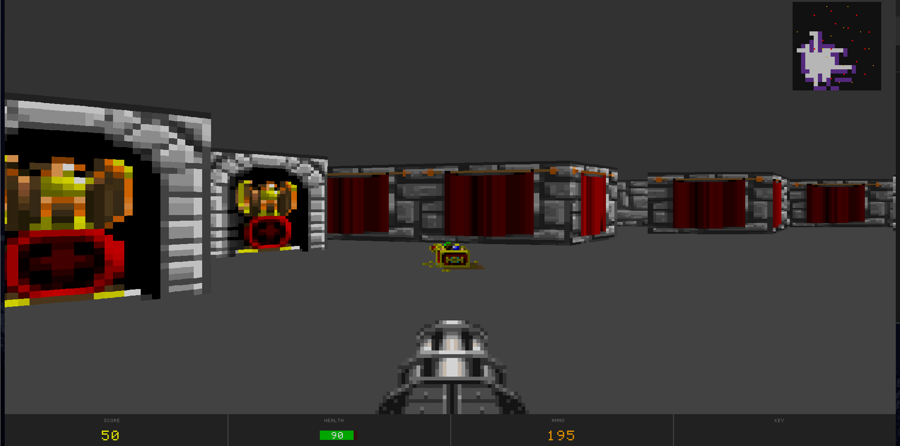
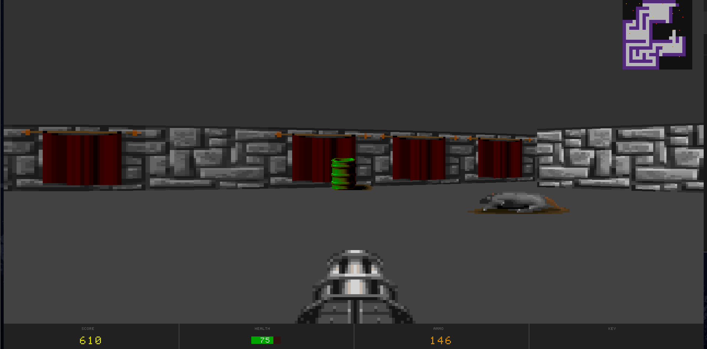
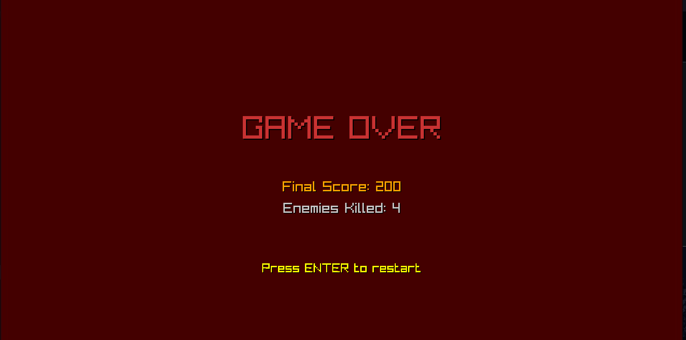

# Wolfenstein Clone - Motor de Raycasting en Rust



---

## 📋 Descripción General

Este proyecto es una implementación de un motor de raycasting 3D inspirado en el clásico Wolfenstein 3D, desarrollado completamente en Rust utilizando la biblioteca raylib. El juego presenta un sistema completo de exploración de mazmorras con combate contra enemigos, recolección de objetos, y múltiples niveles de dificultad.

**Características principales:**
- Motor de raycasting 3D con renderizado de paredes texturizadas
- Sistema de audio completo (música de fondo y efectos de sonido)
- Animaciones de sprites para enemigos y armas
- Minimapa con fog of war (niebla de guerra)
- Sistema de inventario y puntuación
- IA de enemigos con estados (idle, chase, attack)
- Generación procedural de mazos con habitaciones
- Tres niveles de dificultad (pequeño, mediano, grande)
- Sistema de pickups (salud, munición, llaves, tesoros)
- HUD personalizado dibujado pixel a pixel


---

## 🎮 Controles

### Movimiento
- **W** - Avanzar
- **S** - Retroceder
- **A** - Moverse lateral izquierda
- **D** - Moverse lateral derecha

### Cámara
- **Flechas ← →** - Rotar cámara
- **Mouse** - Movimiento de cámara (sensibilidad ajustable)

### Combate
- **Click Izquierdo / Espacio** - Disparar ametralladora

### Navegación de Menús
- **Flechas ↑ ↓** - Navegar opciones
- **Enter** - Confirmar selección
---

## 🔧 Instalación y Ejecución

### Requisitos Previos
- **Rust** (versión 1.70 o superior)
- **Cargo** (incluido con Rust)
- Dependencias del sistema para raylib (varían según la plataforma)

#### Instalación de Rust
```bash
# Linux/macOS
curl --proto '=https' --tlsv1.2 -sSf https://sh.rustup.rs | sh

# Windows
# Descargar e instalar desde: https://rustup.rs/
```

### Compilación y Ejecución

1. **Clonar el repositorio**
```bash
git clone https://github.com/BARHUG0/game_of_life
cd src
```

2. **Cambiar a la rama correct**
```bash
git switch raycasting
```

3. **Ejecutar el juego**
```bash
cargo run
```


---

## ⚙️ Uso de IA
Para la asistencia en la creación de código se empleo el modelo LLM Sonet 4.5 de [Cluade IA](claude.ia) dentro de un proyecto. Un proyecto permite establer instrucciones y un conjunto de archivos disponibles para un grupo de chats. Esto facilita la carga de contexto al modelo para la generación o correción de código. Sin embargo, generalmente no se debe proporcionar todo el código fuente sino únicamente aquellos archivos relacionados al feature que estra trabajando. De este forma el modelo ayudo a la creación de la arquitectura del código y la implementación de algoritmos. 

A continuación, se adjuntan las instrucciones utilizadas.
```
You are an expert in computer graphics programming, specifically using the Rust programming language with the raylib-rs bindings.Your task is to assist the user in learning and implementing graphics algorithms and logic while maintaining good design principles.The user aims to utilize raylib-rs primarily for basic data structures (like Vector, Color, Matrix, Image, etc.) and essential functionalities such as rendering and input handling.

1.Focus on providing guidance and explanations for implementing: - Cameras - Transformations - Lighting - Shaders - Drawing - Geometry - Raycasting - Raytracing - Rasterization (similar to Blender) 

2.When the user shares code snippets from their teacher, adapt and modify these snippets while avoiding simple solutions that could lead to tight coupling and poor design.Aim for a balance between simplicity and maintainability, ensuring that the solutions are clear and easy to understand without being overly complex.


3.Provide examples and explanations that help the user grasp concepts in computer graphics, emphasizing the implementation of algorithms rather than relying heavily on built-in functions or complex architecture.

4.Ensure that responses are practical and relevant to the user’s learning goals, encouraging exploration and experimentation within the context of their projects.

5.Always align your guidance with the knowledge available in the official documentations and ensure that you do not provide outdated or incorrect information.

6. Keep your responses concise and to the point, avoiding lengthy explanations or exhaustive lists that could detract from the user’s engagement and focus.
```
---

## ⚙️ Características Técnicas

### Renderizado
- **Resolución:** 1900x1000 píxeles
- **Viewport 3D:** 1900x900 (los últimos 100px son para el HUD)
- **Algoritmo de Raycasting:** DDA (Digital Differential Analyzer)
- **FOV (Field of View):** 60° (π/3 radianes)
- **Número de rayos:** 320 por frame
- **Tamaño de bloque:** 64x64 píxeles

### Sistema de Renderizado
- Texturas de paredes con variación de iluminación (estilo Wolfenstein)
- Renderizado de sprites billboard con depth sorting
- Sistema de z-buffering para correcta oclusión
- Renderizado de piso y techo con colores sólidos
- HUD personalizado con fuente bitmap

### Generación de Niveles
- **Algoritmo:** Recursive backtracking con generación de habitaciones
- **Tamaños disponibles:**
  - Pequeño: 21x21 celdas, 20 enemigos, 15 sprites
  - Mediano: 29x29 celdas, 35 enemigos, 20 sprites
  - Grande: 35x35 celdas, 50 enemigos, 25 sprites
- La salida se coloca en el punto más lejano del jugador usando BFS

### Sistema de IA
- **Estados de enemigos:** Idle → Chase → Attack → Dead
- **Radio de detección:** 300 píxeles
- **Rango de ataque:** 40 píxeles
- **Velocidad de movimiento:** 80 píxeles/segundo
- **Pathfinding básico** con evasión de colisiones

### Audio
- Sistema de música de fondo con loop automático
- Efectos de sonido con triggers basados en eventos
- Sonido de disparo con loop mientras se mantiene presionado el botón

### Fog of War
- Radio de visión: 4 bloques (256 píxeles)
- Line-of-sight basado en raycasting
- Las áreas exploradas permanecen visibles en el minimapa


---

## 🏗️ Arquitectura del Proyecto

### Estructura de Módulos

```
src/
├── main.rs                  # Loop principal del juego
├── game_screen.rs          # Gestión de pantallas (menú, juego, victoria)
├── game_state.rs           # Estado del juego (salud, munición, puntos)
│
├── player.rs               # Lógica del jugador
├── command.rs              # Sistema de comandos de movimiento
├── controls.rs             # Procesamiento de input
│
├── maze.rs                 # Utilidades para el laberinto
├── maze_generator.rs       # Generación procedural de mazos
│
├── ray.rs                  # Estructura de datos para rayos
├── raycaster.rs           # Algoritmo DDA de raycasting
│
├── framebuffer.rs         # Buffer de píxeles para renderizado
├── renderer.rs            # Renderizado 2D (minimapa, debug)
├── wall_renderer.rs       # Renderizado 3D de paredes
├── sprite_renderer.rs     # Renderizado de sprites y enemigos
├── weapon_renderer.rs     # Renderizado del arma
├── ui_renderer.rs         # Renderizado del HUD
│
├── sprite.rs              # Sistema de sprites y pickups
├── enemy.rs               # Lógica de enemigos y IA
├── weapon.rs              # Sistema de armas y animaciones
│
├── fog_of_war.rs          # Sistema de exploración
└── audio_manager.rs       # Gestión de audio
```

### Flujo de Datos Principal

```
Input (controls.rs)
    ↓
Player Commands (command.rs)
    ↓
Player Update (player.rs) ←→ Maze Collision (maze.rs)
    ↓
Enemy Update (enemy.rs) ←→ Game State (game_state.rs)
    ↓
Raycasting (raycaster.rs)
    ↓
Rendering Pipeline:
    1. Floor/Ceiling (wall_renderer.rs)
    2. Walls (wall_renderer.rs)
    3. Sprites (sprite_renderer.rs)
    4. Enemies (sprite_renderer.rs)
    5. Weapon (weapon_renderer.rs)
    6. HUD (ui_renderer.rs)
    7. Minimap (renderer.rs)
    ↓
Framebuffer → Texture → Screen
```
---
## 📚 Dependencias

```toml
[package]
name = "game_of_life"
version = "0.1.0"
edition = "2024"

[profile.dev]
opt-level = 3

[dependencies]
rand = "0.9.2"
raylib = "5.5.1"
```

### Descripción de Dependencias

- **raylib (5.5.1):** Biblioteca gráfica y de audio multiplataforma. Proporciona funcionalidades para renderizado, input, texturas y sonido.
- **rand (0.9.2):** Generador de números aleatorios utilizado para la generación procedural de mazos y spawn de entidades.

**Nota:** El perfil de desarrollo tiene `opt-level = 3` para mantener buen rendimiento durante el desarrollo, ya que el raycasting puede ser intensivo computacionalmente.
---
## 📚 Referencias

Este proyecto se desarrolló utilizando los siguientes recursos y documentación:

1. **3D Math Primer for Graphics and Game Development**  
   [https://gamemath.com/](https://gamemath.com/)  
   Fundamentos matemáticos de transformaciones 3D, vectores y matrices.

2. **Make Your Own Raycaster - javidx9**  
   [https://www.youtube.com/watch?v=rPn_LKUJ7II](https://www.youtube.com/watch?v=rPn_LKUJ7II)  
   Tutorial excelente sobre implementación práctica de raycasting.

3. **Lode's Computer Graphics Tutorial - Raycasting**  
   [https://lodev.org/cgtutor/raycasting.html](https://lodev.org/cgtutor/raycasting.html)  
   Explicación detallada del algoritmo DDA y técnicas de optimización.

4. **Game Engine Black Book: Wolfenstein 3D - Fabien Sanglard**  
   [https://fabiensanglard.net/b/gebbwolf3d.pdf](https://fabiensanglard.net/b/gebbwolf3d.pdf)  
   Análisis profundo del motor original de Wolfenstein 3D.

---

## 📝 Notas Finales

Este proyecto fue desarrollado con fines educativos para aprender técnicas de gráficos por computadora, específicamente raycasting y renderizado 3D. El código prioriza claridad y comprensión sobre optimización extrema.


