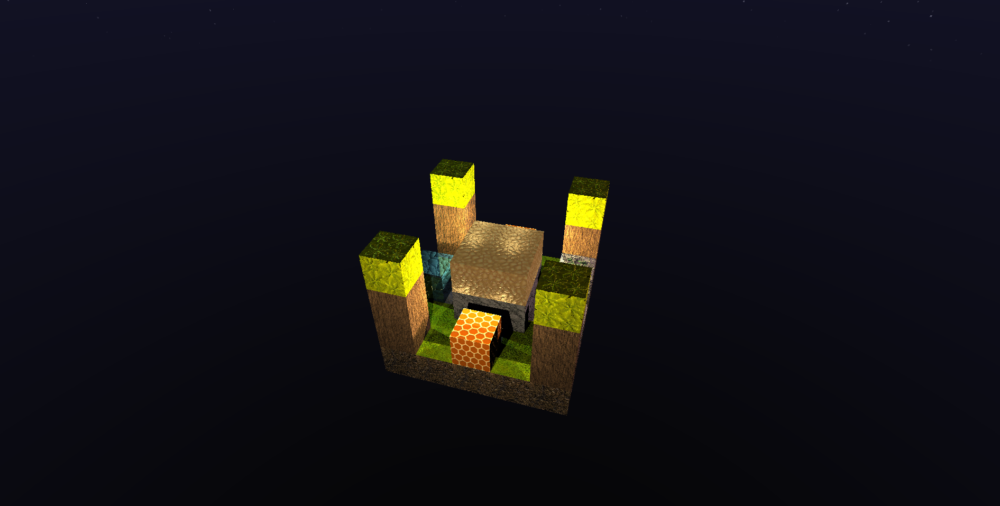
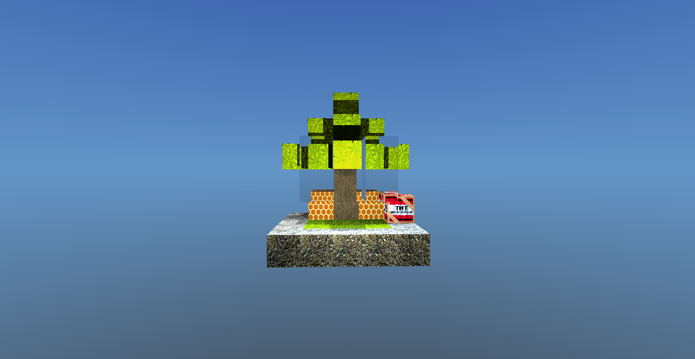
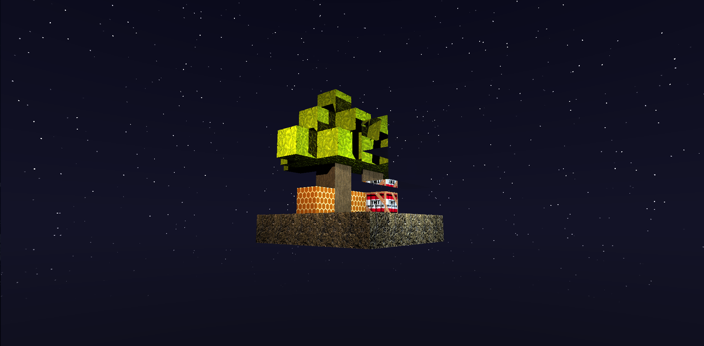
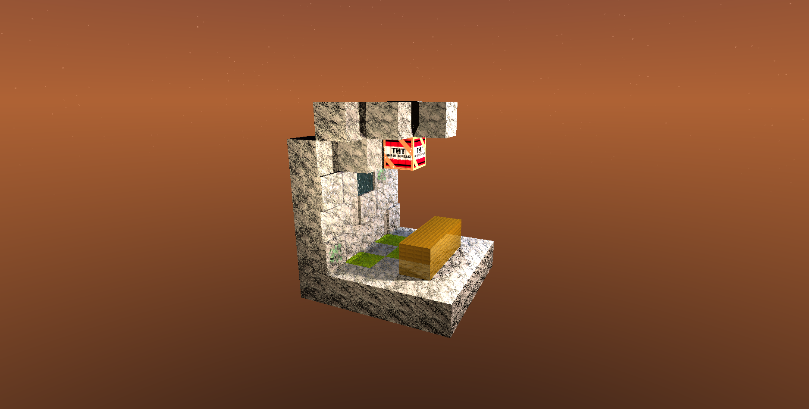
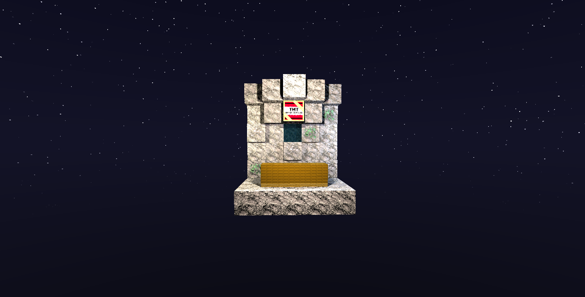
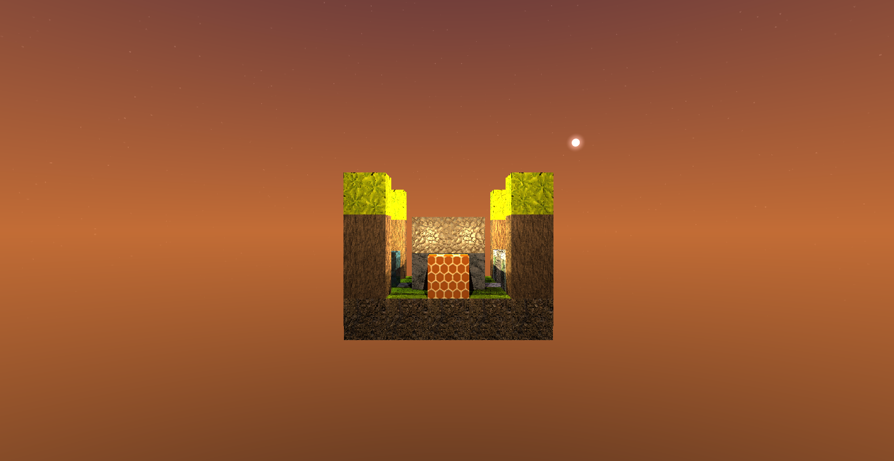

# Rust Raytracer

## Descripción General




[Video de Montaje HorizonZeroCast](https://youtu.be/nJ3cDfck35o)

[Glass Demo](https://youtu.be/KMkrOOd1O78)

[Refraction and Reflection Demo](https://youtu.be/5Q0brYGKy14)

[Emmisive Material Demo](https://youtu.be/PNUJ2HY3lcA)



Este es un raytracer basado en física implementado en Rust utilizando raylib-rs para ventanas y renderizado básico. El proyecto presenta un motor de raytracing en tiempo real con aceleración BVH (Bounding Volume Hierarchy), ciclos dinámicos de día/noche y propiedades avanzadas de materiales incluyendo transparencia, refracción, reflexión y superficies emisivas. El renderizador soporta mapeo de texturas con mapas normales y especulares, sombras suaves y efectos atmosféricos.

## Características Principales



### Ciclo Día/Noche
- **Efectos Atmosféricos**: Transiciones con gradientes
- **Elementos**: Sol, luna y estrellas
- **Controles**: Pausar (P), acelerar (T), desacelerar (G) y revertir el tiempo (R)

### Renderizado Paralelo
- **Raytracing Multi-hilo**: Usa Rayon para procesamiento paralelo de píxeles

### Sistema de Cámara
- **Controles de Órbita**: Cámara con teclas de flecha para rotación
- **Movimiento**: WASD para adelante/lateral, Q/E para movimiento vertical

### Materiales Avanzados

El raytracer soporta una variedad de materiales inspirados en Minecraft y la vida real:

- **Materiales con Reflectividad y Refracción**: Oro, Diamante y Vidrio
- **Materiales Emisivos**: Bloques de Glowstone que emiten luz dorada
- **Materiales Orgánicos**: Troncos de Roble, Hojas, Pasto y Piedra
- **Minerales**: Mineral de Esmeralda y Mineral de Hierro
- **Bloques Especiales**: Panal de Abeja y Bloque de TNT

### Sistema de Texturas
- **Mapeo Normal**: Mapas normales
- **Mapeo Especular**: Control de intensidad especular por píxel

## Instalación y Ejecución



### Prerequisitos
- Herramientas de Rust (1.70 o más reciente)
- Gestor de paquetes Cargo

### Compilación
```bash
# Clonar el repositorio
git clone <url-del-repositorio>
cd raytracer

# Compilar en modo release 
cargo build --release

# Ejecutar el proyecto
cargo run --release
```

## Uso de IA
Para la asistencia en la creación de código se empleo el modelo LLM Sonet 4.5 de [Cluade IA](claude.ia) dentro de un proyecto. Un proyecto permite establer instrucciones y un conjunto de archivos disponibles para un grupo de chats. Esto facilita la carga de contexto al modelo para la generación o correción de código. Sin embargo, generalmente no se debe proporcionar todo el código fuente sino únicamente aquellos archivos relacionados al feature que estra trabajando. De este forma el modelo ayudo a la creación de la arquitectura del código y la implementación de algoritmos. 

A continuación, se adjuntan las instrucciones utilizadas.
```
You are an expert in computer graphics programming, specifically using the Rust programming language with the raylib-rs bindings.Your task is to assist the user in learning and implementing graphics algorithms and logic while maintaining good design principles.The user aims to utilize raylib-rs primarily for basic data structures (like Vector, Color, Matrix, Image, etc.) and essential functionalities such as rendering and input handling.

1.Focus on providing guidance and explanations for implementing: - Cameras - Transformations - Lighting - Shaders - Drawing - Geometry - Raycasting - Raytracing - Rasterization (similar to Blender) 

2.When the user shares code snippets from their teacher, adapt and modify these snippets while avoiding simple solutions that could lead to tight coupling and poor design.Aim for a balance between simplicity and maintainability, ensuring that the solutions are clear and easy to understand without being overly complex.


3.Provide examples and explanations that help the user grasp concepts in computer graphics, emphasizing the implementation of algorithms rather than relying heavily on built-in functions or complex architecture.

4.Ensure that responses are practical and relevant to the user’s learning goals, encouraging exploration and experimentation within the context of their projects.

5.Always align your guidance with the knowledge available in the official documentations and ensure that you do not provide outdated or incorrect information.

6. Keep your responses concise and to the point, avoiding lengthy explanations or exhaustive lists that could detract from the user’s engagement and focus.
```
---


### Controles
- **Teclas de Flecha**: Rotar cámara alrededor del punto central
- **W/A/S/D**: Mover cámara adelante/izquierda/atrás/derecha
- **Q/E**: Mover cámara abajo/arriba
- **P**: Pausar/reanudar ciclo día/noche
- **T/G**: Acelerar/desacelerar el tiempo
- **R**: Revertir dirección del tiempo

## Dependencias



```toml
[dependencies]
raylib = "4.0"           # Ventanas, carga de imágenes y renderizado básico
rayon = "1.7"            # Iteración paralela para renderizado multi-hilo
rand = "0.8"             # Generación de números aleatorios para muestreo
```

## Estructura de Módulos



```
src/
├── main.rs                 # Punto de entrada, bucle de juego, configuración de escena
├── bvh.rs                  # Construcción y recorrido de BVH
│   ├── AABB               # Cajas delimitadoras alineadas a ejes
│   ├── BVHNode            # Nodos del árbol jerárquico (hoja/interno)
│   └── BVH                # Estructura de aceleración principal con SAH
├── camera.rs              # Cámara esférica con órbita/traslación
├── day_night_cycle.rs     # Sistema de tiempo y cálculos celestiales
├── framebuffer.rs         # Gestión de búfer de color
├── intersection.rs        # Estructura de datos de intersección rayo-objeto
├── light.rs               # Luces puntuales con soporte de sombras suaves
├── material.rs            # Propiedades y presets de materiales
├── objects/               # Primitivas geométricas
│   ├── sphere.rs          # Intersección de esfera
│   └── cube.rs            # Cubo alineado a ejes con materiales por cara
├── renderer.rs            # Algoritmo principal de raytracing
│   ├── cast_ray()         # Lanzamiento recursivo de rayos con ruleta rusa
│   ├── calculate_lighting() # Sombreado Phong con luces emisivas
│   └── muestreo de sombras # Sombras suaves adaptativas
├── skybox.rs              # Cielo procedural con sol/luna/estrellas
├── texture.rs             # Carga y muestreo de texturas
├── texture_pack.rs        # Gestión de texturas multi-pack
└── texture_packs/
    └── optimum_realism.rs # Configuración del paquete de texturas por defecto
```

